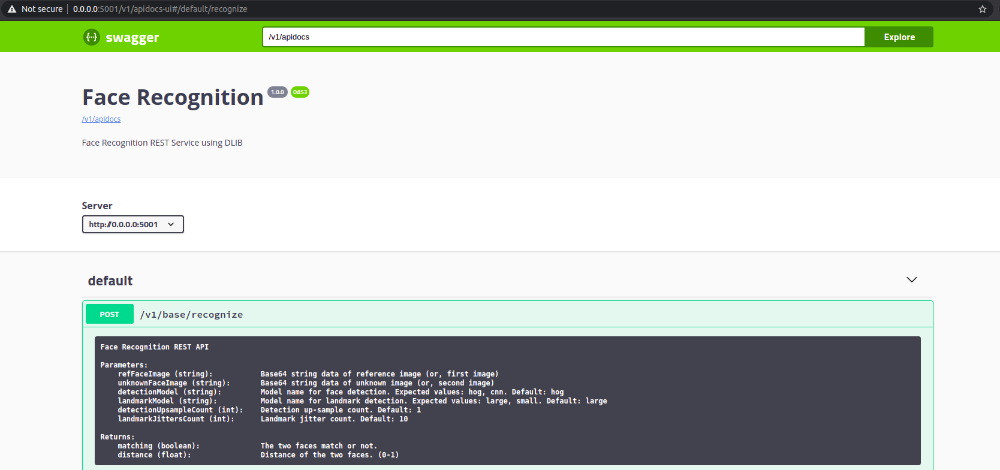

# DLIB Face Recognition Service 
A face recognition service using dlib library. This service exposes a REST API which will take two face images and identify whether they are from same person or not. 

The service is built over flask-rebar framework and containerization support is provided using dockerfile.

**Features:**
*   Expose dlib face recognition service by REST API
*   Expose underline parameters of dlib in the API for both face detections and recognition

**Packaging:** 

The service provides standard production packaging as follows.
*   Environment (dev/ prod/ test) configuration management
*   Logger configuration
*   Error management in HTTP layer
*   DTO management
*   Containerization with docker 
*   Unit test support

### Pre requisite

    python3
    build-essential 
    cmake

### Build `(without docker)`

    $ pip install -r requirements.txt
    
### Run in dev mode `(without docker)`

    $ sh run.dev.sh

### Swagger Documentation
    
    http://localhost:5001/v1/apidocs-ui
    
### API Documentation

### Run in prod mode `(without docker)`

    $ sh run.prod.sh
    
    
### Run unit test

    $ python -m unittest tests.controllers.recognition
    $ python -m unittest tests.services.recognition
    
### Docker

    # To build the image and up the container
    $ docker-compose up --detach
    
    # To stop the container
    $ docker-compose down